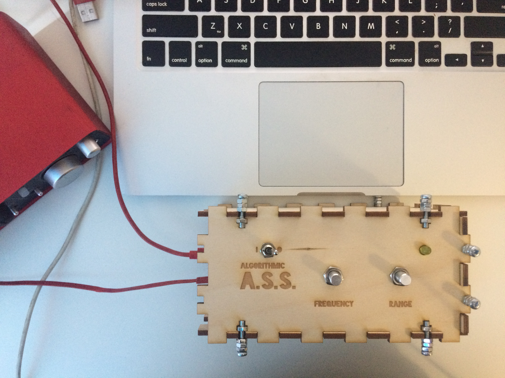
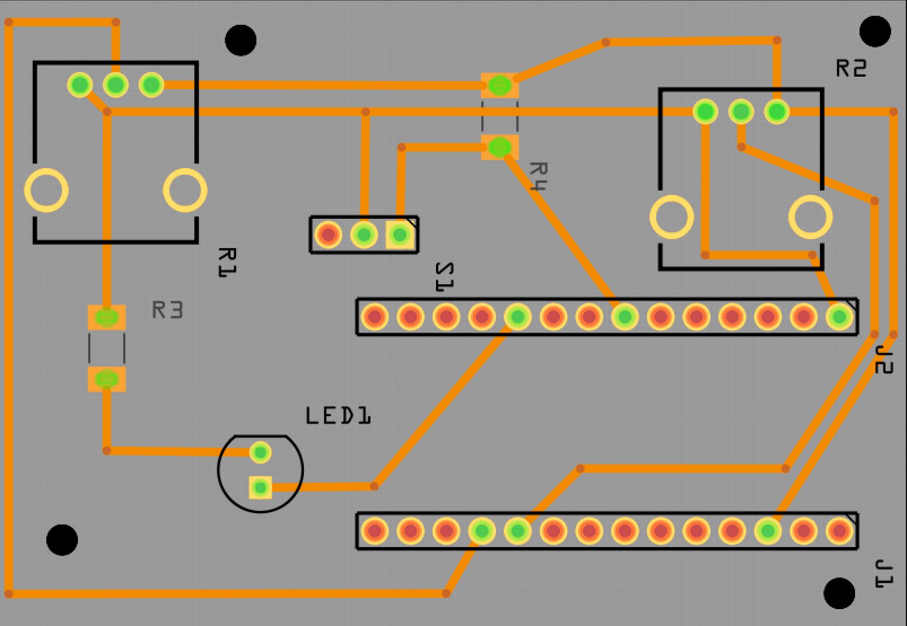
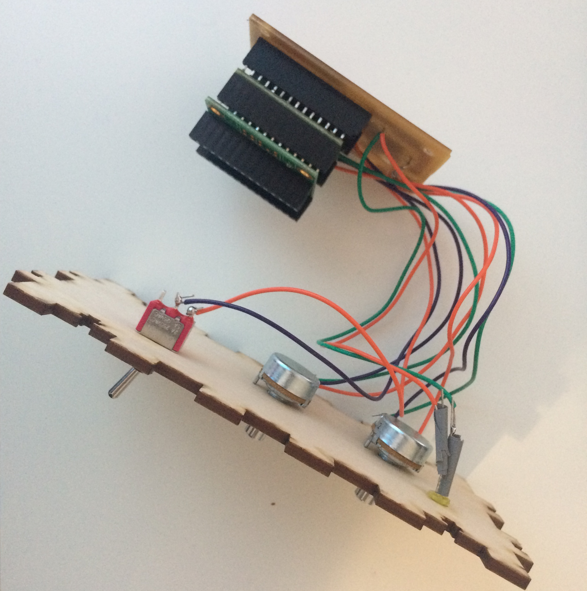

#Algorithmic Attention Seeking Sequencer
#### Physical Interaction Design / Aalto Media Lab 2016

The Algorithmic ASS (Attention Seeking Sequencer) started off as a simple idea of exploring interactions with an unstable system. Built entirely on the Teensy micro controller with the Teensy audio shield, the system is an algorithmic sequencer where the user can set the base frequency and the range of the notes the system can algorithmically cycle through. But there’s an added caveat - if the user stops interacting with the system for a preset time, the system loses interest in cycling through the given scale and can trigger any other note while letting noise build up.

Explored through sound, this project aims to break the notions of machines being perfect and how they’re used. If machines had their own personality disorders how is it like to interact with them? Will users be more empathic to machines if they were more like humans and had inherent flaws? Is it time to stop working towards perfection and embrace humanity in technology?

####Audio Preview
[This is what it sounds line](https://soundcloud.com/obliquevisuals/ass-prototype-preview-1)

####Hardware
1x Teensy Micro Controller  
1x Teensy Audio Shield  
2x 100ohm Potentiometers  
1x LED  
1x Toggle Switch  

####Schematics

####PCB Design

####Audio Design

####Construction

