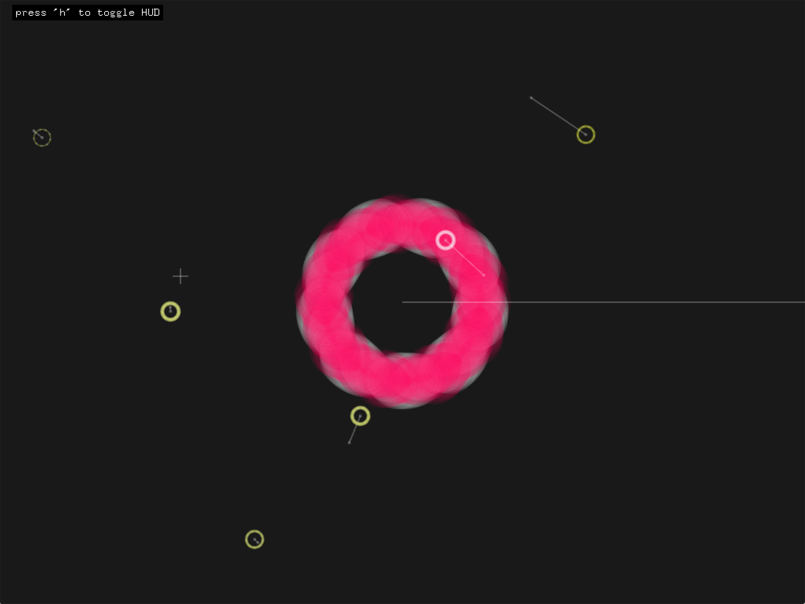
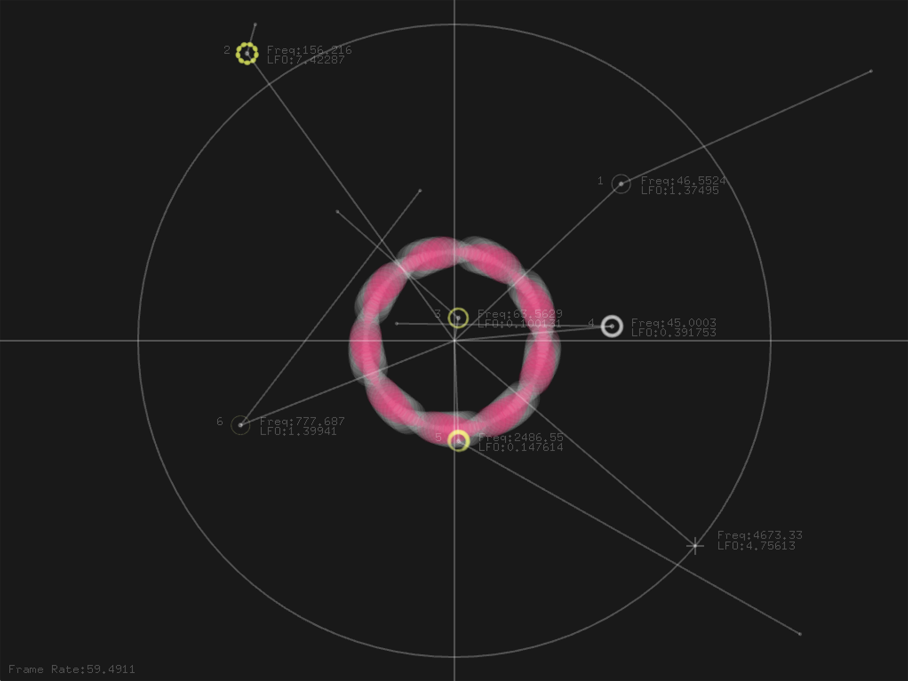

# Polar Oscillators
#### An audiovisual semi-autonomous system of oscillators mapped in a polar space.
Developed during the Generative Media Coding workshop taught by Nuno Correia at Aalto Media Lab, 2017.

Executable can be downloaded [here](https://dl.dropboxusercontent.com/u/37671700/polarOscillators.dmg). [Mac only, unsigned. The OS will cry if Gatekeeper is on.]

#### Screenshot (Clean)

#### Screenshot (wtih HUD)

#### Controls
Pressing 'h' toggles the HUD. 
Numbers 1-6 select individual oscillators. 
Clicking anywhere on screen puts the target position of the selected oscillator at the mouse click coordinates. 
Spacebar randomizes the position of every deselected oscillator. 
Pressing 'a' while any oscillator is selected will toggle the autonomy. 

#### Mapping
The angle to the centre of the screen determines the frequency of the oscillator. 
(Range: 45hz to 7500khz)  
 
The distance to the centre determines the frequency of the LFO wave affecting the oscillator.  
(Range: 0.1hz to 20hz) 
 
The mapping is non-linear in nature.

#### Development
The original idea was to visualize multiple oscillators and their relationships wherein each oscillator would have a different frequency and affecting LFO wave. The original system involved using the screen as an XY pad which moved to the polar coordinate system as a conscious design decision at a very early stage. 

The original system did not involve any autonomous behaviour. Each individual oscillator could be moved by the user/performer or randomized. The autonomous behaviour system was implemented at a later stage and it's a very basic system, not bound by any specific rules and involves random position generators. 

At the final stage of development, a basic collision detection algorithm was added so that individual oscillator cannot be too close to each other. Another collision detection algorithm makes sure that the oscillators cannot move between quadrant 1 and quadrant 4 as the mapping of frequency goes from 0 degrees to 360 degrees and that would cause a jump in frequencies. 

Developed in openFrameworks using the Maximillian addon. [Needs to be two levels inside the openFrameworks directory for development].
