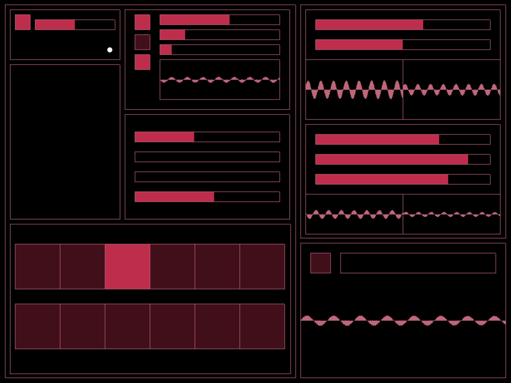

# touchSynth
A touch based synthesizer for the iPad, made during the Multitouch Interaction workshop taught by Nuno Correia, Aalto Media Lab, Spring 2017.

Built with openFrameworks using the Maximilian add-on.
